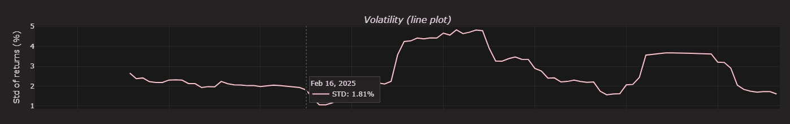

# Bitcoin Data pipeline and Daily Indicators Dashboard

This project is a fully interactive visualization dashboard for analyzing Bitcoin's historical price behavior using daily indicators provided by [Coin Desk][https://developers.coindesk.com/documentation/data-api/index_cc_v1_historical_days].

## 🔍 Overview

The goal is to explore Bitcoin market data through a modular and interactive dashboard, saving data to a SQL database for efficiency. It includes:

- Candlestick charts,
- Technical indicators (Simple Moving Average (SMA), Bollinger Bands, Average True Range (ATR), Volatility),
- Volume and return histograms.

All indicators are adjustable via dropdown menus.

## 💡 Skills Demonstrated
- API integration and data ingestion
- SQLite for structured storage
- Pandas for data manipulation
- Plotly for interactive visualizations
- Jupyter Notebooks for pipeline development and experimentation

## 🧠 Key Features

- Built with **Plotly** and **IPyWidgets** for interactivity,
- SQL database structure for efficient storage and access of large volumes of hourly and daily Bitcoin price data,
- Custom Python functions for calculating technical indicators,
- Clean layout and styling with unified hover interaction.

## 🗃️ Database

This project uses a **SQLite** relational database to store and update Bitcoin market data. It is designed to:

- Handle large datasets efficiently, without overloading the API request capacity,
- Allow for fast querying and aggregation (hourly to daily),
- Support data update scripts and automation.

## 💾 Samples

The files **bitcoin_prices_sample.csv** and **bitcoin_daily indicators** is a reduced random sample of the full dataset cointained in **crypto.db**, used for demonstration purposes and quick testing.


## 📊 Data Visualization

Here are some samples of the interactive dashboards generated by the project:





## 📂 Project Structure

├── data/
│ └── crypto.db # SQLite database with historical price data
│ └── bitcoin_prices_sample.csv #Sample file with historical prices
│ └── bitcoin_daily indicators.csv #Sample file with historical prices and indicators
├── notebooks/
│ └── 01_table_creation_bitcoin.ipynb # Notebook that creates the table
│ └── 02_update_table.ipynb # Notebook that updates the table
│ └── 03_dataviz.ipynb # Interactive dashboard notebook
├── scripts/
│ └── indicators.py # Custom functions for SMA, ATR, Bollinger Bands, etc.
├── requirements.txt
└── README.md

## 🔨 Known issues and future updates

**Incomplete candle detection:**  One of the main current issues is the insertion of the last daily candle. There's a chance that *incomplete candles* are being stored in the database. While these cases are rare, addressing this would significantly improve the consistency of the dataset, since incomplete candles can be misinterpreted as outliers. Filtering out candles before 23:00 improves accuracy, but it is not the solution

**Enhanced user interface:** Enhancing the project with a more interactive and user-friendly interface is a potential improvement. *Deploying it with Dash* would be a great fit, as it integrates seamlessly with Plotly visualizations.

**More indicators:** Expanding the project with **additional technical indicators** would enrich the analysis. Markets — especially highly volatile ones like cryptocurrency — benefit from deeper insights beyond simple OHLCV-based metrics.


## 📦 Installation

1. **Clone the repository**:

```bash
git clone https://github.com/yourusername/bitcoin-indicators-dashboard.git
cd bitcoin-indicators-dashboard
```

2. ***(Optional) Create a virtual environment***
python -m venv venv
source venv/bin/activate  # On Windows: venv\Scripts\activate

3. **Install required packages**
pip install -r requirements.txt

4. **Run the notebooks in order**
Launch the notebooks and run them in this sequence:

01_table_creation_bitcoin.ipynb
02_update_table.ipynb
03_dataviz.ipynb
